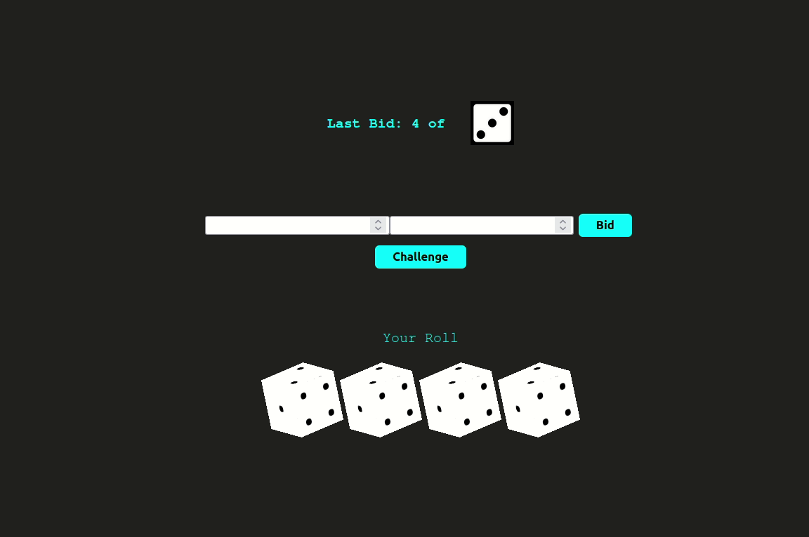

# BlockChain

## Vickrey Auction

Using Solidity we implemented the **vickrey auction** and **bidding ring** smart contracts where one can bid in the *bidding period* with the *hashed amount* and reveal in the *revealing period*.

**Security** is ensured in the smart contract because of sending the hash value of the amount during bidding time by the bidders.

**Visibility** which is to secure certain parts(functions) of the smart contracts  and **Modifiers** which allows the control of the smart contract functions were implemented.



## Liar's Dice Game

Barbossa’s Brethren managed to acquire Queen Anne’s Revenge. They now want to recruit sailors for a journey across the seas and they offer hefty joining bonuses to attract young sailors. The joyous sailors decide to spend all their bonus before the long voyage. Help the sailors lose their money by gambling. You know how the saying goes: Once ye lose yer first hand, ye get hooked! They need a platform for gambling, and looking at the sea shell on your resume, they have approached you. You have to develop an online platform on blockchain, so that they do not make you walk the plank. Since the pirates do not know how to use a terminal, they want you to also develop a front end for the dApp.

So this is a dApp hosting the standard Liar's Dice Game in a distributed setting.



## Resume Verification BlockChain Web App
A demonstration of basic resume information verification using blockchain. The agents provide a web browser interface to show establishing relationships between agents, issuing verifiable credentials, and proving claims from verifiable credentials. The entire project has been implemented using HyperLedger Indy.


