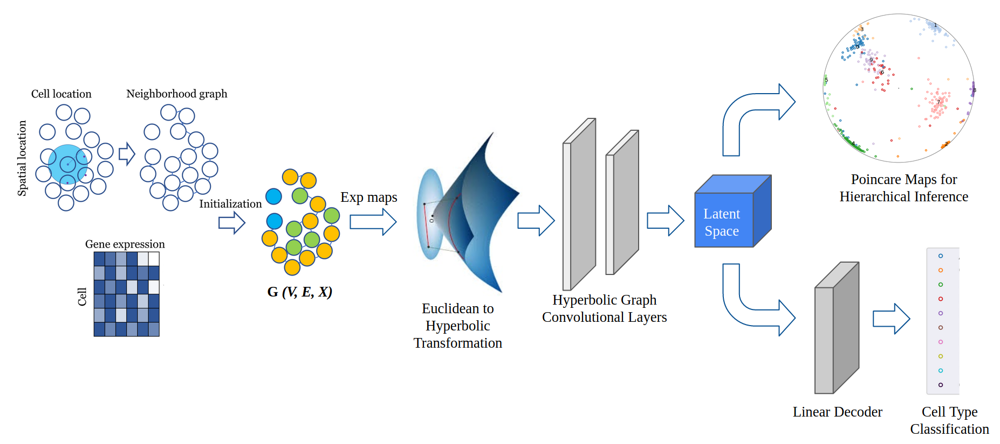
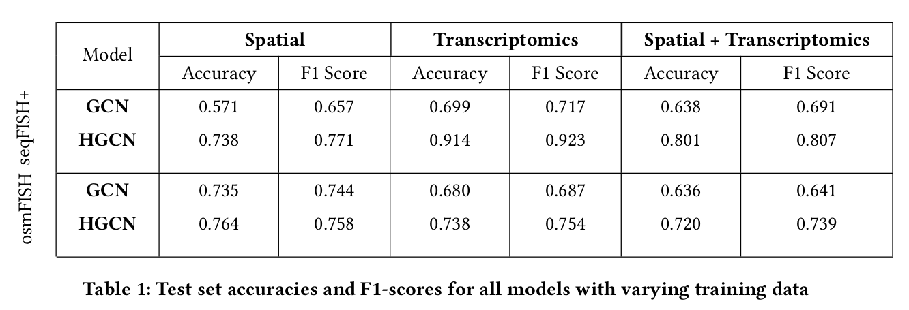
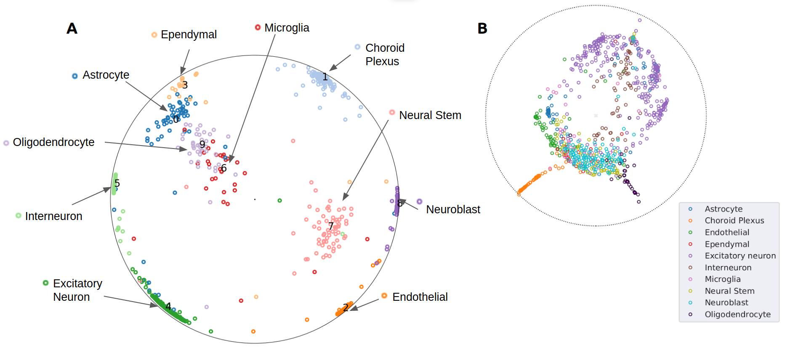

# Lower Dimensional Representation for Spatial Transcriptomics Data in Hyperbolic Space

Advancement in the field of fluorescence in situ hybridisation has introduced the scope of utilizing the information of spatial location in addition to the gene expression for single cell RNA sequencing analysis. Due to heterogeneity and high dimensional nature of the data, an important facet in these studies is to associate, arrange and identify cells to infer biological relevant information. We propose the use of Hyperbolic Graph Convolutional Networks (HGCN) to transform this complex data into a lower dimensional embedding, which while preserving spatial and hierarchical information, opens up a space for various downstream data analysis tasks like cell type identification, hierarchical inference, clustering, etc. We apply HGCN on seqFISH+ and osmFISH spatial transcriptomics data and show that the embeddings learnt in hyperbolic geometry perform better than the corresponding euclidean networks. The learned representations are plotted using Poincare Maps to infer hierarchies among cells that successfully captures biologically relevant information in the form of clustered cell types arranged in the order of their developmental stages.

## Results

We evaluate the performance of hyperbolic neural network model against other methods and present the empirical results based on functional analysis of different aspects. We base our analysis on different facets that play an important role in scRNA seq analysis, which are cell type classification, clustering and low dimensional visualisation of hierarchies.

## Conclusion

Using hyperbolic manifold in graph networks improves the performances of scRNA seq analysis, owing to the hierarchical nature of the data which is well captured by poincare maps. Integrating spatial information along with scRNA seq data augments the ability to visualise and infer hierarchical relationship across cells types. We have compared and shown empirical results proving these claims, as well as introduced discussions of using hyperbolic neural networks in analysing of spatial transcriptomics. As an extension to this work, the learned lower dimensional embeddings could be used to explore other scRNA seq analysis tasks like ligand receptor interaction between cells and marker gene identification. With the scalability provided by graph neural networks, other types of cellular data could be easily integrated to augment the quality of the results obtained.



